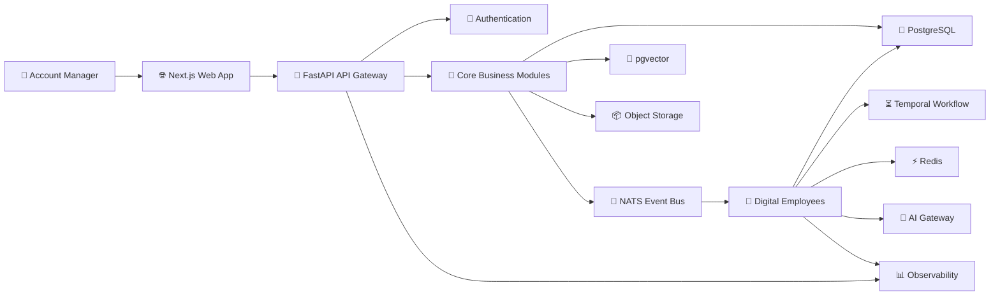
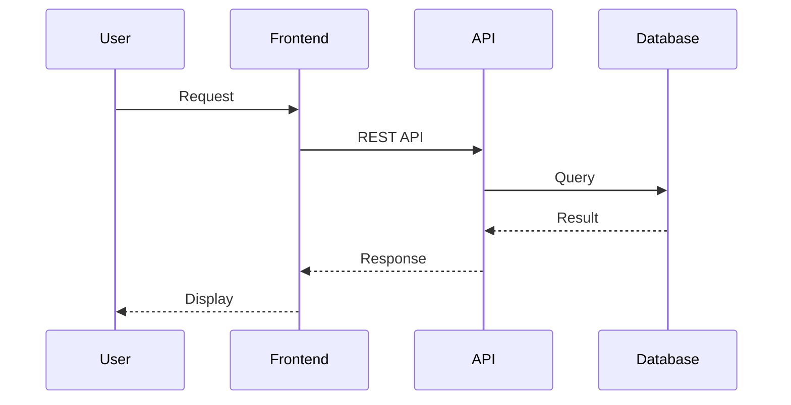
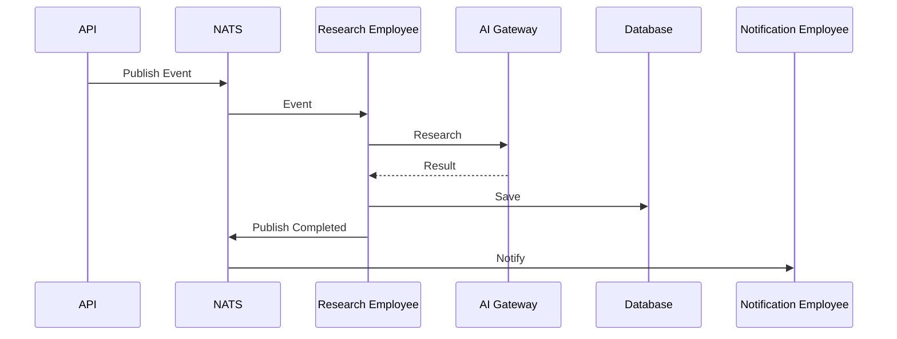

# 🏗️ System Architecture

> **"A great architecture allows the system to evolve without rewriting its foundation."**

---

# Purpose

This document defines the high-level architecture of the platform.

It describes how every major component interacts, communicates, and evolves over time.

This document serves as the architectural reference for:

- Human Engineers
- AI Coding Agents
- Software Architects
- Technical Reviewers

---

# Architectural Vision

The platform is designed as an **AI-Native, Event-Driven, Modular, Cloud-Native System**.

Every component should be independently deployable, independently testable, and independently replaceable.

The architecture prioritizes:

- Scalability
- Maintainability
- Observability
- Extensibility
- Reliability

over short-term implementation speed.

---

# High-Level Architecture

---

# System Layers

The platform consists of six logical layers.

---

## 1. Presentation Layer

Responsible for user interaction.

Technology:

- Next.js
- React
- Tailwind CSS
- shadcn/ui

Responsibilities:

- Dashboard
- Search
- Account View
- Opportunity View
- Digital Employee Inbox
- Notifications

---

## 2. API Layer

Responsible for exposing business capabilities.

Technology:

- FastAPI

Responsibilities:

- Authentication
- Authorization
- Validation
- API Contracts
- Rate Limiting

The API layer never contains business logic.

---

## 3. Domain Layer

The heart of the platform.

Contains business modules.

Examples:

- Account
- Opportunity
- Proposal
- Forecast
- Activity
- Meeting
- Knowledge

Every module owns:

- Business Logic
- Events
- APIs
- Database Access

---

## 4. AI Layer

Contains all Digital Employees.

Examples:

- Research Employee
- News Employee
- Opportunity Employee
- Proposal Employee
- Forecast Employee

Every Digital Employee:

- subscribes to events
- performs specialized work
- publishes new events

---

## 5. Infrastructure Layer

Provides technical capabilities.

Includes:

- PostgreSQL
- Redis
- NATS
- Temporal
- AI Gateway
- Object Storage

Infrastructure never contains business rules.

---

## 6. Observability Layer

Responsible for monitoring platform health.

Includes:

- Metrics
- Logs
- Traces
- Error Tracking
- Health Checks

Observability is mandatory.

---

# Architectural Principles

The architecture follows these principles:

- Domain Driven Design
- Event Driven Architecture
- AI-Native Design
- Cloud Native
- Modular Architecture
- API First
- Infrastructure as Code
- Observability First

---

# Core Components

## Frontend

Technology:

- Next.js

Responsibilities:

- User Interface
- User Experience
- Authentication
- API Communication

---

## Backend

Technology:

- FastAPI

Responsibilities:

- Business APIs
- Authentication
- Validation
- Event Publishing

---

## Event Bus

Technology:

- NATS

Responsibilities:

- Decouple services
- Trigger Digital Employees
- Enable asynchronous communication

No module should directly call another module for long-running processes.

---

## Workflow Engine

Technology:

- Temporal

Responsibilities:

- Long-running workflows
- Retry
- Resume
- Scheduling
- Orchestration

Temporal manages business workflows.

NATS manages events.

---

## AI Gateway

Responsibilities:

- Provider Routing
- Prompt Management
- Cost Tracking
- Retry Logic
- Model Selection
- Token Monitoring

No module should directly communicate with LLM providers.

---

## Database

Technology:

- PostgreSQL

Stores:

- Business Data
- Configuration
- Metadata

---

## Vector Database

Technology:

- pgvector

Stores:

- Embeddings
- Semantic Search
- AI Memory

---

## Redis

Responsibilities:

- Cache
- Queue
- Session
- Rate Limiting
- Temporary Memory

---

## Object Storage

Stores:

- Documents
- Attachments
- Images
- Knowledge Files

---

# Communication Flow

## Synchronous Flow

---

## Asynchronous Flow

---

# Deployment Philosophy

Every service should be independently deployable.

No service should require another service to be redeployed.

Deployment should remain simple.

Cloud Run is the primary runtime.

Docker is mandatory.

---

# Scalability Strategy

Scale horizontally.

Never vertically unless necessary.

Every worker should be stateless.

Every service should be replaceable.

Events enable independent scaling.

---

# Reliability Strategy

The platform must survive:

- API failures
- AI failures
- Network failures
- Worker failures
- Database retries

Every critical workflow should support:

- Retry
- Timeout
- Resume

---

# Security Model

Authentication

↓

Authorization

↓

Validation

↓

Business Rules

↓

Persistence

Never bypass this order.

---

# Observability Strategy

Every component must expose:

- Structured Logs
- Metrics
- Traces
- Health Status
- Error Reports

No production service should operate without observability.

---

# Future Expansion

The architecture is designed to support:

- Mobile Applications
- Desktop Applications
- Public APIs
- Third-Party Plugins
- Marketplace
- Multi-Tenant SaaS
- AI Marketplace
- Customer Digital Employees

without redesigning the core platform.

---

# Architecture Goals

The architecture is considered successful if:

- New modules can be added independently.
- New Digital Employees require no architectural changes.
- AI providers can be replaced without changing business logic.
- Every service is observable.
- Every workflow is testable.
- Every module remains loosely coupled.

---

# Final Principle

> **"The architecture should allow the platform to grow from one developer to one hundred developers without changing its foundation."**