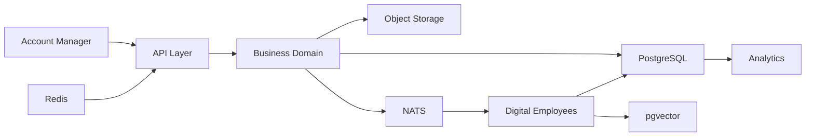

# 🗄️ Data Architecture

> **"Data is the memory of the platform. Design it to outlive the software."**

---

# Purpose

This document defines how data is structured, stored, governed, accessed, and evolved across the platform.

It establishes the rules for designing databases, ownership boundaries, AI memory, caching, search indexes, audit trails, and long-term scalability.

Technology may evolve.

Data principles should remain stable.

---

# Data Philosophy

The platform treats data as a strategic asset.

Every piece of data must have:

- Ownership
- Purpose
- Lifecycle
- Security
- Traceability

No anonymous data.

No orphaned data.

No duplicated ownership.

---

# Data Architecture Overview



---

# Data Storage Strategy

The platform uses different storage technologies based on data characteristics.

| Data Type | Storage |
|------------|----------|
| Business Data | PostgreSQL |
| AI Embeddings | pgvector |
| Cache | Redis |
| Documents | Object Storage |
| Events | NATS |
| Logs | OpenTelemetry / Loki |
| Metrics | Prometheus |
| Traces | Tempo |

Each technology has a single responsibility.

---

# Source of Truth

There is always one authoritative source.

Example:

Account Name

↓

PostgreSQL

NOT

Redis

NOT

Vector Database

NOT

Frontend Cache

All other copies are temporary.

---

# Data Ownership

Every domain owns its own data.

Example:

Account Domain

Owns:

- Accounts
- Contacts
- Relationships

Opportunity Domain

Owns:

- Opportunities
- Pipeline
- Forecast

Knowledge Domain

Owns:

- Knowledge Articles
- Documents
- Product Knowledge

No shared ownership.

---

# Data Categories

## Operational Data

Business transactions.

Examples:

- Accounts
- Opportunities
- Meetings
- Activities

Stored in PostgreSQL.

---

## Knowledge Data

Reference information.

Examples:

- Product Catalog
- Industry Reports
- Sales Playbooks

Stored in PostgreSQL + Object Storage.

---

## AI Memory

Embeddings.

Semantic relationships.

Long-term context.

Stored in pgvector.

---

## Cache

Temporary.

Never authoritative.

Stored in Redis.

Can be safely rebuilt.

---

## Event Data

Messages.

Notifications.

Workflow triggers.

Transient by design.

Handled by NATS.

---

# PostgreSQL Guidelines

PostgreSQL stores:

- Business Entities
- Transactions
- Relationships
- Metadata
- Configurations

Rules:

Normalize until necessary.

Denormalize only for performance.

Business integrity always wins.

---

# pgvector Guidelines

Vector Database stores:

- Embeddings
- Semantic Memory
- Search Context

Never store business truth inside vectors.

Vectors augment knowledge.

They never replace relational data.

---

# Redis Guidelines

Redis stores:

- Cache
- Sessions
- Rate Limits
- Temporary AI Context
- Short-lived Queues

Redis is disposable.

Everything must survive Redis loss.

---

# Object Storage

Stores:

- PDFs
- Images
- Presentations
- Contracts
- Proposal Files
- Knowledge Attachments

Only metadata belongs in PostgreSQL.

---

# Multi-Tenancy

Every record belongs to exactly one Workspace.

```
Workspace

↓

Organization

↓

Account

↓

Opportunity

↓

Activities
```

Cross-tenant access is forbidden.

Tenant isolation is mandatory.

---

# Data Lifecycle

Every entity follows:

```
Created

↓

Active

↓

Updated

↓

Archived

↓

Deleted
```

Deletion should be rare.

Archiving is preferred.

---

# Soft Delete Policy

Business data should use:

```
deleted_at
```

Instead of:

```
DELETE FROM ...
```

Benefits:

- Recovery
- Auditability
- AI Learning
- Historical Analytics

---

# Audit Trail

Every critical action should record:

- Who
- What
- When
- Before
- After
- Source

Nothing important disappears.

---

# Versioning

Important documents should support versions.

Examples:

- Proposal
- Business Case
- Solution Design
- AI Prompt Templates

History is valuable.

---

# Data Relationships

Business relationships should be explicit.

Example:

Workspace

↓

Organization

↓

Account

↓

Contact

↓

Opportunity

↓

Proposal

↓

Activity

↓

Document

Avoid hidden relationships.

---

# AI Memory Strategy

AI uses three memory layers.

## Working Memory

Current task.

Temporary.

Redis.

---

## Long-Term Memory

Historical context.

pgvector.

---

## Business Truth

Authoritative records.

PostgreSQL.

Never confuse these layers.

---

# Search Strategy

Search combines:

- Full Text Search
- Semantic Search
- Filters
- Structured Queries

Hybrid Search provides the best experience.

---

# Data Consistency

Business transactions must remain consistent.

Rules:

Critical writes are synchronous.

AI enrichment is asynchronous.

Business integrity is never sacrificed.

---

# Data Security

Every record should support:

- Tenant Isolation
- Row-Level Security
- Encryption in Transit
- Encryption at Rest
- Audit Logs

Security is part of the data model.

---

# AI Data Access

Digital Employees never access databases directly.

They use:

Domain APIs

or

Published Events

This preserves domain boundaries.

---

# Backup Strategy

Business Data

Daily Backup

Point-in-Time Recovery

AI Memory

Rebuildable if necessary

Object Storage

Versioned

Encrypted

Multi-region ready

---

# Data Retention

Retention depends on data type.

Business Data

Long-term

Audit Logs

Configurable

AI Cache

Hours or Days

Embeddings

Rebuildable

Temporary Events

Minutes

Storage follows business value.

---

# Data Quality

Every domain is responsible for:

- Accuracy
- Completeness
- Freshness
- Consistency
- Traceability

Data quality is a business responsibility.

Not only an engineering responsibility.

---

# Data Principles

Always prefer:

Single Source of Truth

↓

Clear Ownership

↓

Explicit Relationships

↓

Versioned Changes

↓

Traceable History

↓

Observable Data

↓

Secure Access

---

# Success Metrics

The architecture succeeds when:

- No duplicated ownership exists.
- Every entity has a lifecycle.
- AI knows where to read information.
- Every change is auditable.
- Data survives infrastructure changes.
- Business rules remain independent from storage technology.

---

# Final Principle

> **"Applications come and go. Data remains."**

> **Protect the data, and the platform will endure.**