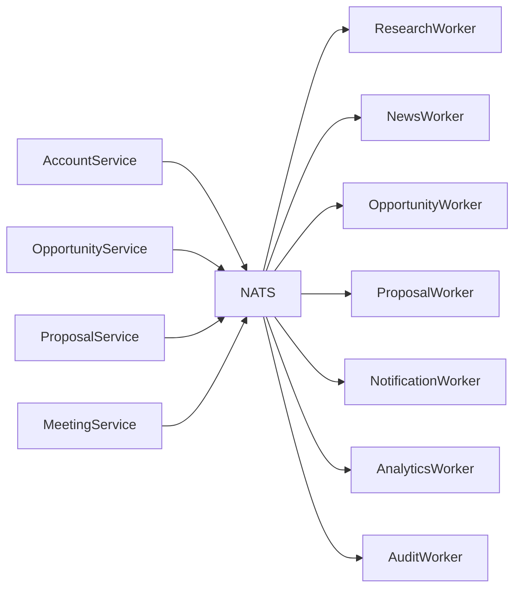
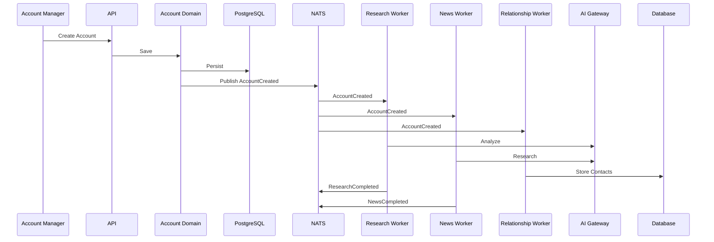

# 📡 Event Architecture

> **"Events are the nervous system of the platform."**

---

# Purpose

This document defines how services, domains, and Digital Employees communicate.

The platform follows an **Event-Driven Architecture (EDA)** where events represent business facts that have already happened.

Events decouple services, enable autonomous Digital Employees, and allow the platform to scale horizontally without increasing complexity.

---

# Event Philosophy

An event is **a business fact**.

Examples:

- Account Created
- Contact Added
- Meeting Completed
- Proposal Generated
- Opportunity Won

Events describe **what happened**.

They never describe **what should happen**.

---

# Core Principles

## Events are Immutable

Once published, an event never changes.

If something changes, publish a new event.

Never modify historical events.

---

## Events Represent Business Facts

Good:

```
AccountCreated
ProposalSubmitted
MeetingCompleted
OpportunityWon
```

Bad:

```
CreateAccount
SendProposal
RunResearch
```

Commands tell.

Events inform.

---

## Publish Once

A business action should produce one authoritative event.

Multiple consumers may react.

The publisher never knows who will consume it.

---

## Loose Coupling

Publishers do not know subscribers.

Subscribers do not know publishers.

NATS is responsible for delivery.

---

# High-Level Architecture



---

# Event Categories

The platform defines four categories.

---

## Domain Events

Business events.

Examples:

```
AccountCreated
ContactAdded
MeetingCompleted
OpportunityWon
```

---

## AI Events

Produced by Digital Employees.

Examples:

```
ResearchCompleted
IndustryAnalysisCompleted
ProposalDraftReady
RiskDetected
```

---

## System Events

Infrastructure.

Examples:

```
UserSignedIn
CacheExpired
WorkflowStarted
WorkflowCompleted
```

---

## Integration Events

External communication.

Examples:

```
CRMImported
EmailReceived
ERPUpdated
WebhookReceived
```

---

# Event Naming Convention

Events use PascalCase.

Pattern:

```
<Entity><PastTenseVerb>
```

Examples:

```
AccountCreated
MeetingCompleted
OpportunityQualified
ProposalApproved
ForecastUpdated
```

Avoid technical names.

Always use business language.

---

# Event Structure

Every event follows the same schema.

```json
{
  "eventId": "uuid",
  "eventType": "AccountCreated",
  "version": "1.0",
  "timestamp": "ISO8601",
  "workspaceId": "...",
  "actorId": "...",
  "entityId": "...",
  "payload": {},
  "metadata": {}
}
```

---

# Event Metadata

Every event includes:

- Event ID
- Version
- Timestamp
- Correlation ID
- Causation ID
- Workspace ID
- Actor ID
- Source Service

Metadata enables tracing.

---

# Correlation ID

All events generated from one business process share the same Correlation ID.

Example:

```
AccountCreated

↓

ResearchCompleted

↓

IndustryAnalysisCompleted

↓

OpportunitySuggested
```

One Correlation ID.

One business story.

---

# Causation ID

Tracks which event produced another event.

Example:

```
AccountCreated

↓

ResearchStarted

↓

ResearchCompleted
```

Every child event references its parent.

---

# Event Versioning

Events evolve.

Never break existing consumers.

Rules:

- Add fields.
- Never remove fields.
- Version major changes.

---

# Event Ownership

Every event has exactly one publisher.

Example:

```
AccountCreated

Publisher:

Account Domain
```

Many subscribers.

Only one publisher.

---

# Event Consumers

Examples:

```
AccountCreated

↓

Research Worker

↓

News Worker

↓

Relationship Worker

↓

Notification Worker

↓

Analytics Worker
```

Independent.

Parallel.

Scalable.

---

# Event Topics

NATS subjects follow:

```
account.created

account.updated

contact.created

meeting.completed

proposal.generated

forecast.updated
```

Use lowercase.

Dot notation.

Business language.

---

# Event Flow Example



---

# Event Retry Policy

Transient failures:

Retry automatically.

Permanent failures:

Dead Letter Queue.

Retries use exponential backoff.

Never retry forever.

---

# Dead Letter Queue

Failed events move to DLQ.

Reasons include:

- Invalid payload
- Consumer failure
- Schema mismatch

Nothing disappears silently.

---

# Event Idempotency

Consumers must be idempotent.

Receiving the same event twice must produce the same result.

Duplicate delivery must never corrupt data.

---

# Event Ordering

Only guarantee ordering where required.

Do not rely on global ordering.

Ordering belongs to business workflows.

---

# Event Size

Events should be lightweight.

Good:

```
Account ID
Workspace ID
Company Name
```

Bad:

Entire Account Object

Entire Proposal PDF

Large Attachments

Store references.

Not large payloads.

---

# Event Security

Sensitive information should never be published.

Avoid:

Passwords

Secrets

Tokens

Private Credentials

Publish IDs instead.

---

# AI Event Flow

Digital Employees communicate only through events.

Example:

```
AccountCreated

↓

ResearchCompleted

↓

IndustryAnalyzed

↓

BuyingSignalsDetected

↓

OpportunitySuggested

↓

ProposalRecommended
```

No worker calls another worker directly.

---

# Observability

Every event should expose:

- Publish Time
- Consume Time
- Processing Time
- Retry Count
- Failure Count

Events are observable.

---

# Event Monitoring

Track:

- Events Per Minute
- Consumer Lag
- Failed Events
- Retry Rate
- Processing Latency

Healthy events mean healthy AI.

---

# Event Governance

Before creating a new event ask:

- Is this a business fact?
- Does it already exist?
- Can another event be reused?
- Is the name business-friendly?
- Is ownership clear?

If uncertain,

do not publish.

---

# Success Metrics

A successful event architecture enables:

- Independent deployments
- Parallel processing
- Autonomous Digital Employees
- High scalability
- Easy extensibility
- Clear observability

without increasing coupling.

---

# Final Principle

> **"Services communicate through APIs.**

> **Digital Employees collaborate through events."**