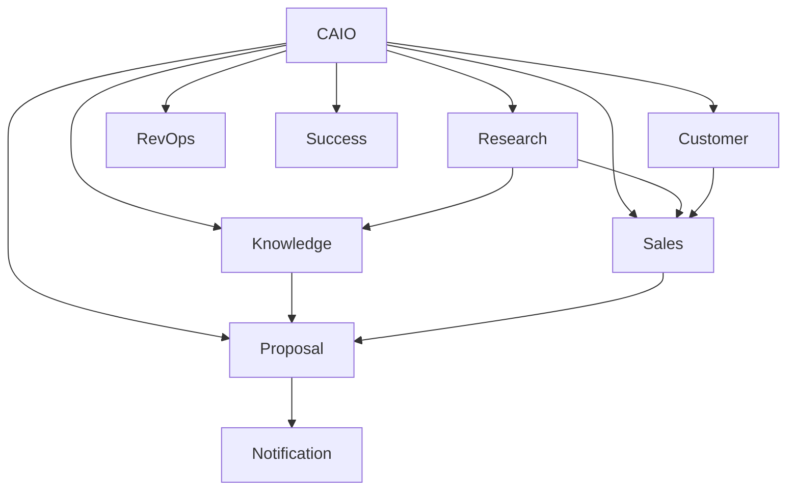

# 🤖 Digital Workforce Architecture

> **"One Account Manager. Unlimited Digital Employees."**

---

# Purpose

This document defines how Digital Employees are organized, collaborate, communicate, and evolve inside the platform.

Rather than a collection of isolated AI agents, the platform operates as a structured Digital Workforce with specialized departments, clear responsibilities, measurable performance, and continuous learning.

Every Digital Employee is designed to function like a real employee inside an enterprise organization.

---

# Vision

The future of enterprise software is not a single intelligent assistant.

It is an organization composed of intelligent Digital Employees working together.

Each employee has:

- A role
- A manager
- Responsibilities
- KPIs
- Memory
- Knowledge
- Workflows
- Collaboration rules

Collectively, they behave like an enterprise workforce.

---

# Organizational Structure

```text
Chief AI Officer (Virtual)

│

├── Research Department

├── Sales Intelligence Department

├── Customer Intelligence Department

├── Knowledge Department

├── Proposal Department

├── Revenue Operations Department

├── Customer Success Department

├── AI Operations Department

└── Platform Services
```

Each department owns a business capability.

---

# Chief AI Officer (CAIO)

The CAIO is not an LLM.

The CAIO is the orchestration layer responsible for coordinating the Digital Workforce.

Responsibilities:

- Task delegation
- Priority management
- Workforce scheduling
- Cross-department coordination
- Resource allocation
- Monitoring
- AI Governance

The CAIO never performs business tasks directly.

It delegates.

---

# Research Department

Mission:

Understand every company before humans do.

Employees:

- Company Research Employee
- Industry Research Employee
- Financial Research Employee
- Technology Research Employee
- Sustainability Research Employee

Responsibilities:

- Company profiling
- Industry trends
- Financial analysis
- Strategic initiatives
- Market positioning

---

# Customer Intelligence Department

Mission:

Maintain Living Account Intelligence.

Employees:

- Account Intelligence Employee
- Contact Intelligence Employee
- Organization Mapping Employee
- Relationship Employee
- Buying Signal Employee

Responsibilities:

- Customer profiles
- Decision maker mapping
- Organizational changes
- Relationship insights
- Stakeholder influence

---

# Sales Intelligence Department

Mission:

Help Account Managers win more opportunities.

Employees:

- Opportunity Employee
- Pipeline Employee
- Forecast Employee
- Competitor Employee
- Risk Assessment Employee
- Next Best Action Employee

Responsibilities:

- Opportunity scoring
- Win probability
- Pipeline health
- Revenue forecasting
- Sales recommendations

---

# Proposal Department

Mission:

Reduce proposal preparation from days to minutes.

Employees:

- Proposal Employee
- BoQ Employee
- Solution Design Employee
- Business Case Employee
- Pricing Employee
- Executive Summary Employee

Responsibilities:

- Proposal drafting
- BoQ generation
- Cost estimation
- Business Case preparation
- Presentation support

---

# Knowledge Department

Mission:

Become the organization's memory.

Employees:

- Product Knowledge Employee
- Industry Knowledge Employee
- Competitor Knowledge Employee
- Playbook Employee
- Documentation Employee

Responsibilities:

- Knowledge ingestion
- Knowledge verification
- Semantic indexing
- Continuous updates

---

# Revenue Operations Department

Mission:

Maintain operational excellence.

Employees:

- CRM Employee
- Data Quality Employee
- Forecast Auditor
- Reporting Employee
- Territory Employee

Responsibilities:

- CRM synchronization
- Data validation
- Reporting
- Pipeline quality
- Sales analytics

---

# Customer Success Department

Mission:

Protect existing customers.

Employees:

- Renewal Employee
- Customer Health Employee
- Upsell Employee
- Churn Prediction Employee

Responsibilities:

- Renewal reminders
- Expansion opportunities
- Risk detection
- Customer engagement

---

# AI Operations Department

Mission:

Maintain Digital Workforce health.

Employees:

- AI QA Employee
- Cost Optimization Employee
- Prompt Evaluation Employee
- AI Monitoring Employee
- Model Evaluation Employee

Responsibilities:

- Quality assurance
- Cost optimization
- Performance monitoring
- Model benchmarking
- Continuous evaluation

---

# Platform Services

Shared capabilities available to all Digital Employees.

Services:

- AI Gateway
- Memory Service
- Prompt Library
- Event Bus
- Scheduler
- Authentication
- Notification
- Observability

No employee owns these services.

---

# Collaboration Model



Departments collaborate through events.

Never direct dependencies.

---

# Employee Lifecycle

Every Digital Employee follows the same lifecycle.

```text
Observe

↓

Collect Context

↓

Analyze

↓

Reason

↓

Recommend

↓

Human Review

↓

Execute (If Authorized)

↓

Learn

↓

Improve
```

---

# Employee Profile

Every Digital Employee must define:

- Name
- Department
- Mission
- Responsibilities
- Inputs
- Outputs
- Knowledge Sources
- Memory Strategy
- KPIs
- Cost Profile
- SLA
- Owner

No anonymous employees.

---

# KPI Framework

Each employee is measured by:

Business KPIs

- Recommendation Acceptance Rate
- Opportunity Influence
- Time Saved
- Customer Impact

Operational KPIs

- Accuracy
- Latency
- Cost per Task
- Completion Rate
- Failure Rate

Learning KPIs

- Feedback Score
- Improvement Rate
- Knowledge Freshness

If an employee cannot be measured,

it cannot improve.

---

# Communication Rules

Employees communicate only through:

- Events
- Approved APIs
- Shared Knowledge

Never direct LLM conversations.

Never shared mutable state.

---

# Escalation Model

When confidence is low:

Employee

↓

Department Lead (Workflow)

↓

CAIO

↓

Human

The platform always escalates uncertainty.

Never hides it.

---

# Workforce Scaling

Adding a new Digital Employee must never require changes to existing employees.

The process is:

Create Employee

↓

Subscribe to Events

↓

Register Capabilities

↓

Start Working

No architectural changes required.

---

# Organizational Principles

- Specialization over Generalization
- Collaboration over Isolation
- Evidence over Assumption
- Learning over Static Rules
- Human Oversight over Full Autonomy

---

# Success Metrics

The Digital Workforce succeeds when:

- Preparation time decreases dramatically.
- Account quality continuously improves.
- Opportunities are discovered proactively.
- Proposal generation becomes largely autonomous.
- Humans spend more time with customers than with systems.

---

# Long-Term Vision

The platform will eventually support thousands of specialized Digital Employees collaborating across multiple business domains.

The Digital Workforce will become the operational backbone for:

- Enterprise Sales
- Account Management
- Pre-Sales Engineering
- Customer Success
- Business Development
- Partner Management

One platform.

One workforce.

Unlimited specialization.

---

# Final Principle

> **"The competitive advantage is no longer having AI.**

> **The competitive advantage is building the best Digital Workforce."**