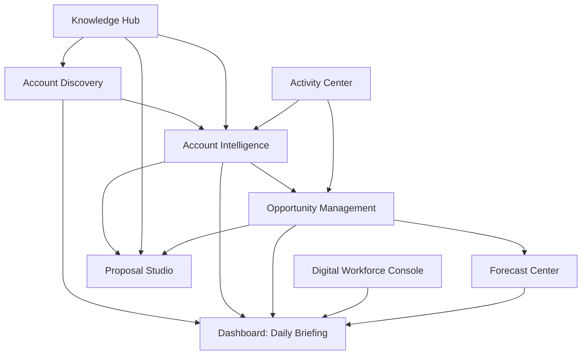

# 📋 Product Requirements Document

> **"The best Account Manager is not the one who works the hardest. It is the one with the best intelligence."**

---

# Purpose

Every document before this answered:

- **Why** we are building (Layer 1 — Vision)
- **How** we build (Layer 2 — Constitution)
- **How the system works** (Layer 3 — Architecture)

This document answers:

**What exactly will be built.**

For whom.

In what order.

With what definition of success.

---

# Core Problem

## The Hardest Part of Being an Account Manager

Getting new accounts is the hardest challenge in enterprise sales.

Not because Account Managers lack skills.

Not because the products are bad.

But because the process of finding the right company, at the right time, with the right reason to reach out — has always depended on:

- Luck
- Manual research
- Personal networks
- Intuition built over years

This platform changes that.

We replace luck with intelligence.

We replace manual research with Digital Employees.

We replace intuition with data-driven signals.

---

# Who We Build For

## Primary Persona

**Name:** Enterprise Account Manager

**Profile:**

- Works at a telco, IT solutions company, or system integrator
- Manages 20–50 enterprise accounts simultaneously
- Responsible for pipeline growth and revenue targets
- Has strong relationship and solution-selling skills
- Understands both technical solutions and business value

**Daily Pain Points:**

- Does not know which new companies to approach
- Does not know the right timing to reach out
- Spends hours researching companies manually before meetings
- Proposal preparation takes days instead of hours
- CRM feels like a reporting tool, not a selling tool
- Loses track of account updates, news, and stakeholder changes

**What They Want:**

- To spend more time talking to customers
- To know exactly who to call tomorrow morning
- To arrive at every meeting fully prepared
- To find opportunities before competitors do
- To have a team that does the research and preparation

---

## Secondary Persona

**Name:** Sales Manager / Workspace Administrator

**Profile:**

- Manages a team of Account Managers
- Responsible for team performance and pipeline health
- Owns knowledge management and team playbooks

**Needs:**

- Visibility into team AI usage and performance
- Control over workspace knowledge content
- Team-wide pipeline and activity analytics

---

# The Platform Vision (Applied to This Document)

We are not building a CRM.

We are building a **Digital Workforce Operating System for Account Managers.**

Every morning, an Account Manager should arrive at a platform where:

- New account opportunities have already been discovered
- Company intelligence has already been updated
- Buying signals have already been identified
- Meeting preparations are already complete
- Recommended next actions are already prioritized

The Account Manager reviews.

Decides.

Takes action.

The Digital Workforce has already done everything else.

---

# Product Modules

The platform consists of the following modules.

---

## Module 1 — Account Discovery

**Priority:** Core

**This is the most important module in the platform.**

**Mission:**

Help Account Managers find the right companies to approach, at the right time, for the right reason.

**Core Capabilities:**

- Automatic discovery of potential new accounts based on configurable criteria
- Scoring and prioritization of discovered accounts
- Trigger-based alerts: leadership changes, company expansions, funding rounds, digital transformation signals
- Territory management and account assignment
- Discovery pipeline separate from active accounts

**Digital Employees Involved:**

- Company Research Employee
- Buying Signal Employee
- Account Scoring Employee
- Territory Intelligence Employee

**Success State:**

> An Account Manager opens the platform and finds high-potential new accounts already discovered, researched, and scored — ready to review. No manual searching required.

---

## Module 2 — Account Intelligence

**Priority:** Core

**Mission:**

Maintain a continuously updated, intelligent profile for every account.

Accounts are never static.

Companies hire. Companies expand. Companies change strategy. Companies buy new technology. Companies change executives.

Every account must continuously become smarter over time.

**Core Capabilities:**

- Living company profile (always current, never stale)
- Automated news and update monitoring
- Decision maker and stakeholder mapping
- Industry and market intelligence
- Relationship history and sentiment
- Financial health indicators
- Technology landscape (systems and vendors in use)
- Strategic initiative tracking

**Digital Employees Involved:**

- Account Intelligence Employee
- Contact Intelligence Employee
- Industry Research Employee
- News Employee
- Relationship Employee

**Success State:**

> Every account profile is more complete today than it was yesterday — without the Account Manager doing anything.

---

## Module 3 — Opportunity Management

**Priority:** Core

**Mission:**

Help Account Managers track, qualify, and win opportunities systematically.

**Core Capabilities:**

- Opportunity pipeline management
- AI-assisted deal scoring and qualification
- Competitor intelligence per opportunity
- Win probability prediction
- Recommended next actions per deal
- Stale deal detection and alerts
- Win/loss analysis for continuous learning

**Digital Employees Involved:**

- Opportunity Employee
- Pipeline Employee
- Competitor Employee
- Risk Assessment Employee
- Next Best Action Employee
- Forecast Employee

---

## Module 4 — Digital Workforce Console

**Priority:** Core

**Mission:**

Give Account Managers full visibility and control over their Digital Employees.

This is the **command center** of the platform.

**Why This Module Is Critical:**

If Digital Employees work invisibly, Account Managers will not trust them.

Visibility builds trust.

Trust enables adoption.

Adoption creates value.

**Core Capabilities:**

- Real-time view of all Digital Employee activity
- Recommendation inbox: approve, reject, provide feedback
- Task and workflow status tracking
- AI performance metrics per employee
- Cost monitoring per workspace
- Learning feedback loop management

**This module closes the loop between AI work and human validation.**

---

## Module 5 — Proposal Studio

**Priority:** High

**Mission:**

Reduce proposal preparation from days to minutes.

**Core Capabilities:**

- AI-assisted proposal generation from account context
- Bill of Quantity (BoQ) builder
- High Level Design (HLD) support
- Business Case generation
- Executive Summary drafting
- Proposal versioning and history
- Customizable template library per workspace

**Digital Employees Involved:**

- Proposal Employee
- BoQ Employee
- Business Case Employee
- Executive Summary Employee
- Pricing Employee
- Solution Design Employee

---

## Module 6 — Knowledge Hub

**Priority:** High

**Mission:**

This module is the brain of every Digital Employee.

Provide the right knowledge to the right Digital Employee at the right time.

**Architecture — Three Knowledge Layers:**

```
Layer 1 — Platform Knowledge
─────────────────────────────
Available to all users across all workspaces.
Read-only for users. Managed by platform.

Examples:
- General industry intelligence frameworks
- Public market data structures
- Global best practice templates

Layer 2 — Workspace Knowledge
─────────────────────────────
Owned and managed by each organization.
Fully configurable per tenant.

Examples:
- Company product catalog and pricing
- Internal sales playbooks and SOPs
- Competitor battlecards
- Case studies and references
- Approved proposal templates

Layer 3 — Personal Knowledge
─────────────────────────────
Owned by each Account Manager.
Private and personal.

Examples:
- Personal account notes and context
- Relationship history and preferences
- Individual meeting insights
- Private observations
```

Every Digital Employee draws from all three layers when performing their work.

Tenant isolation is absolute.

No workspace can access another workspace's knowledge.

---

## Module 7 — Activity and Meeting Center

**Priority:** High

**Mission:**

Capture every customer interaction and transform it into organizational intelligence.

**Core Capabilities:**

- AI-generated meeting summaries
- Action item extraction from meeting notes
- Follow-up task management
- Call logging and summaries
- Email thread context capture
- Activity timeline per account

**Every activity becomes institutional memory.**

---

## Module 8 — Forecast Center

**Priority:** Medium

**Mission:**

Give Account Managers and Sales Managers accurate, AI-adjusted revenue forecasting.

**Core Capabilities:**

- Pipeline-based revenue forecast
- AI-adjusted probability per deal
- Historical accuracy tracking
- Monthly and quarterly scenario modeling
- Team-level forecasting for Sales Managers

---

## Module 9 — Dashboard: Daily Briefing

**Priority:** Core

**Mission:**

This is the first screen an Account Manager sees every morning.

It must answer three questions in 60 seconds:

1. What happened overnight?
2. Who should I contact today?
3. What do I need to prepare?

**Core Capabilities:**

- New account discoveries since last login
- Buying signals detected in existing accounts
- Important account updates and news
- Pending Digital Employee recommendations awaiting review
- Today's prioritized next actions
- Digital Employee activity summary

**The Dashboard is the proof of the platform's value.**

If the Dashboard is empty, the platform has failed its mission.

---

## Module 10 — Settings and Administration

**Priority:** Required

**Capabilities:**

- Workspace configuration and setup
- User management and role assignment
- Knowledge Hub Layer 2 administration
- Digital Employee configuration and preferences
- Integration management
- Usage and cost monitoring

---

# Module Relationship Map



Every module ultimately feeds the Dashboard.

The Dashboard is the window into everything the Digital Workforce has prepared.

---

# Multi-Tenancy Design

The platform is designed for multi-tenancy from day one.

**Personal use today. SaaS tomorrow. No architectural changes required.**

Every workspace is completely independent.

```
Workspace A — User: Teguh (IOH)
    Knowledge: IOH products, pricing, playbooks
    Accounts: Regional Central Sumatera territory
    Digital Employees: Configured for telco enterprise sales

Workspace B — Another Company
    Knowledge: Their own products and playbooks
    Accounts: Their own territory
    Digital Employees: Same architecture, different knowledge

No data crosses workspace boundaries.
No knowledge is shared without explicit permission.
```

This is enforced at the data architecture level as defined in `09_DATA_ARCHITECTURE.md`.

---

# MVP Scope

The MVP proves one complete loop end-to-end.

## MVP Goal

> An Account Manager opens the platform and finds new high-potential accounts discovered by Digital Employees — with enough intelligence to know exactly who to call and why.

This single loop proves every core principle of the platform.

---

## MVP Modules

**Included in MVP:**

- Account Discovery (core capability)
- Account Intelligence (living profile)
- Digital Workforce Console (review and feedback)
- Knowledge Hub (Workspace layer only)
- Dashboard — Daily Briefing (simplified)
- Settings (basic workspace setup)

**Not in MVP:**

- Proposal Studio
- Forecast Center
- Activity Center (full implementation)
- Mobile application
- External CRM integrations
- Advanced analytics

---

## MVP Digital Employees

MVP launches with two Digital Employees.

**Digital Employee 1: Company Research Employee**

- Researches discovered companies automatically
- Builds initial account intelligence profile
- Identifies key decision makers
- Summarizes company background and strategic direction

**Digital Employee 2: Buying Signal Employee**

- Monitors target companies for trigger events
- Scores accounts by readiness and timing
- Recommends which accounts to prioritize
- Explains why a signal matters for this specific Account Manager

These two employees together prove the core value proposition.

Every other Digital Employee is additive.

---

## MVP Success Criteria

The MVP is successful when:

- An Account Manager can discover 5 new qualified accounts per week without manual searching
- Account intelligence profiles are built automatically after account creation
- Buying signals are surfaced with clear explanations
- The Dashboard provides a meaningful Daily Briefing every morning
- The Account Manager provides feedback that improves future recommendations

---

# V2 Scope

After MVP is validated:

- Proposal Studio (full implementation)
- Full Knowledge Hub (all three layers)
- Activity and Meeting Center
- Opportunity Management (full pipeline)
- Additional Digital Employees per department
- Basic team features for Sales Managers

---

# Future Scope

Long-term vision:

- Mobile application
- WhatsApp and email thread integration
- Public API for third-party integrations
- Custom Digital Employee marketplace
- Multi-language support
- Advanced Revenue Intelligence
- Partner and reseller support

---

# User Journey: The Daily Loop

```
06:00 --- Digital Employees work overnight
          Research. Monitor. Analyze. Score.
          The workforce never sleeps.

08:00 --- Account Manager opens Dashboard
          Sees: new discoveries, buying signals, account updates

08:15 --- Reviews Digital Employee recommendations
          Approves. Rejects. Provides feedback.
          Every feedback improves the next recommendation.

09:00 --- Calls the first priority account
          Already knows: company news, decision maker, why today is the right time

10:30 --- Attends customer meeting
          Fully prepared. No last-minute research the night before.

12:00 --- Logs meeting notes
          AI extracts action items and updates account intelligence automatically

14:00 --- Reviews proposal draft
          Already prepared by Proposal Employee based on account context

17:00 --- Reviews tomorrow's priorities
          Already prepared and waiting

18:00 --- Account Manager closes the laptop.
          Digital Employees keep working.
```

---

# Success Metrics

## User Experience Metrics

| Metric | Target |
|---|---|
| New accounts discovered per week per AM | > 5 |
| Account intelligence completeness score | > 80% |
| Recommendation acceptance rate | > 60% |
| Daily active usage | > 80% of registered users |
| Time saved per account research | > 2 hours per account |

## Business Impact Metrics

| Metric | Direction |
|---|---|
| Pipeline value per Account Manager | Increase |
| Proposal preparation time | Decrease |
| Win rate for AI-recommended accounts | Increase vs. manually found accounts |
| New account acquisition rate per AM | Increase |

## AI Performance Metrics

| Metric | Target |
|---|---|
| Buying signal accuracy | > 70% accepted by AM |
| Research quality score (human feedback) | > 4/5 |
| Digital Employee task completion rate | > 95% |
| Cost per account intelligence update | Tracked and optimized |

---

# Product Principles

These principles extend `02_PRODUCT_PHILOSOPHY.md` specifically for this product.

---

## Account Discovery Is the Foundation

Without new accounts, there is no pipeline.

Without pipeline, there is no revenue.

Every feature must ultimately support the Account Manager's ability to find and win accounts.

Features that do not contribute to this should not be built.

---

## Intelligence Before Activity

Most CRMs track what Account Managers did.

This platform prepares what Account Managers should do.

We are not a system of record.

We are a system of intelligence.

---

## Trust Is Built Incrementally

Account Managers will not trust AI recommendations immediately.

The platform earns trust through:

- Evidence for every recommendation (source, confidence, timestamp)
- Transparency of reasoning
- Accuracy that improves over time
- Human control at every step

As defined in `04_AI_CONSTITUTION.md`: every recommendation must be explainable.

---

## Every Module Feeds the Core

Every module must ultimately support Account Discovery and Account Intelligence.

If a feature does not help the Account Manager find or win accounts, question whether it belongs here.

---

## SaaS-Ready from Day One

The platform is used by one person today.

But every architectural decision supports multi-tenancy.

When a second tenant arrives, the answer is configuration — not refactoring.

This principle applies especially to the Knowledge Hub.

---

# Anti-Goals

What this platform will NOT do:

No — Replace the Account Manager's relationships and human judgment.

No — Automate customer conversations without human involvement.

No — Become a traditional CRM that Account Managers must feed with data.

No — Require extensive manual data entry before providing value.

No — Build features that do not contribute to finding or winning accounts.

No — Expose one tenant's data to another tenant.

---

# Relationship to Other Documents

This document defines **WHAT** we build.

| Question | Document |
|---|---|
| Why we build this | `00_VISION_AND_NORTH_STAR.md` |
| What we believe | `01_PRODUCT_MANIFESTO.md` |
| How we make product decisions | `02_PRODUCT_PHILOSOPHY.md` |
| How we engineer | `03_ENGINEERING_CONSTITUTION.md` |
| How AI must behave | `04_AI_CONSTITUTION.md` |
| How the system is structured | `06_SYSTEM_ARCHITECTURE.md` |
| How data is organized | `09_DATA_ARCHITECTURE.md` |
| How modules communicate | `10_EVENT_ARCHITECTURE.md` |
| How the Digital Workforce is organized | `11_DIGITAL_WORKFORCE_ARCHITECTURE.md` |

This document does not contradict any of the above.

It applies them to a concrete product definition.

---

# Final Principle

> **"The Account Manager's job is to build relationships and win deals.**
>
> **Everything else is the Digital Workforce's job."**
