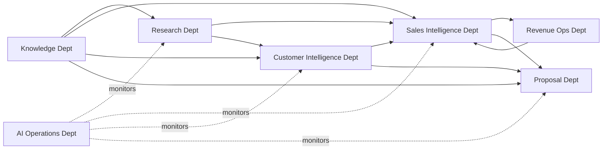

# 14 — Department Blueprint

> **"An organization without structure is not a workforce. It is chaos with good intentions."**

---

# Purpose

This document defines the organizational structure of the Digital Workforce.

Every Digital Employee belongs to a Department.

Every Department has a clear mission, defined employees, and defined interactions with other departments.

This blueprint ensures that when the digital workforce scales from 2 employees to 20 employees, the organizational logic remains coherent.

This document extends `11_DIGITAL_WORKFORCE_ARCHITECTURE.md` with operational-level department definitions.

---

# Organizational Principle

The Digital Workforce is organized identically to how a high-performing enterprise sales team is organized.

Every department mirrors a real human function in enterprise sales.

```
Chief AI Officer (Virtual — Orchestration Layer)
        │
        ├── Research Department
        │       Company Research Employee
        │       Industry Research Employee
        │       News Employee
        │
        ├── Sales Intelligence Department
        │       Buying Signal Employee
        │       Account Scoring Employee
        │       Competitor Employee
        │       Next Best Action Employee
        │       Risk Assessment Employee
        │       Pipeline Employee
        │       Forecast Employee
        │
        ├── Customer Intelligence Department
        │       Account Intelligence Employee
        │       Contact Intelligence Employee
        │       Relationship Employee
        │       Meeting Employee
        │
        ├── Knowledge Department
        │       Knowledge Indexing Employee
        │       Documentation Employee
        │
        ├── Proposal Department
        │       Proposal Employee
        │       Executive Summary Employee
        │       BoQ Employee
        │       Business Case Employee
        │       Solution Design Employee
        │       Pricing Employee
        │
        ├── Revenue Operations Department
        │       Opportunity Employee
        │       Territory Intelligence Employee
        │
        ├── Customer Success Department
        │       (Future — post-sale AI employees)
        │
        └── AI Operations Department
                AI Operations Monitor
                Dashboard Priority Employee
```

---

# Chief AI Officer — Virtual Orchestration Layer

**Type:** Orchestration (not a Digital Employee)

**Mission:** Coordinate cross-department workflows and resolve inter-employee dependencies.

**Responsibilities:**
- Route events to the correct department
- Manage task queues and priorities
- Detect workflow bottlenecks
- Surface AI Operations alerts

**Implementation:** The Chief AI Officer is not a single AI model. It is the combination of:
- Temporal workflow engine (long-running orchestration)
- NATS event bus (event routing)
- Dashboard Priority Employee (daily aggregation)

---

# Department 1 — Research Department

**Mission:** Gather accurate, current, and relevant information about companies and industries.

**Motto:** *"Before anyone can sell, someone must understand."*

## Employees

### Company Research Employee
- **Trigger:** AccountDiscovered, AccountCreated
- **Does:** Deep company research — structure, strategy, financials, technology
- **Produces:** Company Research Summary
- **MVP:** ✅ Yes
- **Implementation:** ✅ **BUILT** — `workers/company-research/` using LiteLLM + Gemini 2.5 Flash + Tavily

### Industry Research Employee
- **Trigger:** AccountCreated (industry not yet profiled), Scheduled (monthly)
- **Does:** Industry landscape, trends, regulatory environment
- **Produces:** Industry Intelligence Report
- **MVP:** ❌ V2
- **Implementation:** ❌ Not built

### News Employee
- **Trigger:** Scheduled (daily, per active account)
- **Does:** Monitors news for company mentions and signal events
- **Produces:** Account News Feed
- **MVP:** ✅ Yes
- **Implementation:** ❌ **NOT BUILT** — DB table `account_news` exists. Worker needed in Phase 10.

## Inter-Department Flow
```
Research Department → (publishes ResearchCompleted)
    → Sales Intelligence Department (triggers scoring)
    → Customer Intelligence Department (updates account profile)
```

---

# Department 2 — Sales Intelligence Department

**Mission:** Identify opportunities, assess deal potential, and guide Account Managers to the highest-value actions.

**Motto:** *"Intelligence is the difference between a good guess and a confident decision."*

## Employees

### Buying Signal Employee
- **Trigger:** ResearchCompleted, NewsCompleted, Scheduled (daily)
- **Does:** Detects trigger events signaling purchase readiness
- **Produces:** Buying Signal Report with confidence score
- **MVP:** ✅ Yes
- **Implementation:** ❌ **NOT BUILT** — Phase 10. Note: basic signal detection proto-logic exists in `activities.py` (`detect_buying_signals`), but no dedicated worker yet.

### Account Scoring Employee
- **Trigger:** ResearchCompleted, BuyingSignalDetected
- **Does:** Scores discovered accounts on 0–100 scale
- **Produces:** Account Score with justification
- **MVP:** ✅ Yes
- **Implementation:** ❌ **NOT BUILT** — Only `completeness_score` (0-100) exists in DB. No AI scoring logic yet.

### Competitor Employee
- **Trigger:** OpportunityCreated, Scheduled (weekly per active opportunity)
- **Does:** Identifies competitors per opportunity and recommends counter-strategy
- **Produces:** Competitor Intelligence Report
- **MVP:** ❌ V2
- **Implementation:** ❌ Not built

### Next Best Action Employee
- **Trigger:** DealScoreUpdated, MeetingCompleted, OpportunityStageChanged
- **Does:** Recommends one specific action per opportunity per day
- **Produces:** Next Best Action Recommendation
- **MVP:** ❌ V2
- **Implementation:** ❌ Not built

### Risk Assessment Employee
- **Trigger:** Scheduled (daily, per active opportunity)
- **Does:** Detects stalling deals and close date risks
- **Produces:** Deal Risk Alert
- **MVP:** ❌ V2
- **Implementation:** ❌ Not built

### Pipeline Employee
- **Trigger:** Scheduled (daily)
- **Does:** Monitors overall pipeline health
- **Produces:** Pipeline Health Report
- **MVP:** ❌ V2
- **Implementation:** ❌ Not built

### Forecast Employee
- **Trigger:** OpportunityStageChanged, DealScoreUpdated, Scheduled (weekly)
- **Does:** Calculates AI-adjusted revenue forecast
- **Produces:** ForecastUpdated event with breakdown
- **MVP:** ❌ V2
- **Implementation:** ❌ Not built

## Inter-Department Flow
```
Sales Intelligence → (publishes AccountScored, BuyingSignalDetected)
    → Dashboard (AM sees priorities)
    → Customer Intelligence (enriches account profile)
    → Proposal Department (opportunity context for proposals)
```

---

# Department 3 — Customer Intelligence Department

**Mission:** Build and maintain the deepest possible understanding of every account and every contact.

**Motto:** *"Know the customer better than they know themselves."*

## Employees

### Account Intelligence Employee
- **Trigger:** AccountCreated, AccountIntelligenceUpdateRequested
- **Does:** Builds and maintains living account profile
- **Produces:** AccountIntelligenceUpdated event
- **MVP:** ✅ Yes

### Contact Intelligence Employee
- **Trigger:** AccountCreated, Scheduled (weekly per account)
- **Does:** Identifies and maps key contacts and decision makers
- **Produces:** ContactAdded, DecisionMakerIdentified events
- **MVP:** ✅ Yes

### Relationship Employee
- **Trigger:** MeetingCompleted, CallLogged, Scheduled (daily)
- **Does:** Analyzes interaction history and relationship strength
- **Produces:** RelationshipRiskDetected if no contact for threshold period
- **MVP:** ❌ V2

### Meeting Employee
- **Trigger:** MeetingCompleted (raw notes submitted)
- **Does:** Generates meeting summary, extracts action items, identifies signals
- **Produces:** MeetingNoteCreated with structured output
- **MVP:** ❌ V2

## Inter-Department Flow
```
Customer Intelligence → (publishes AccountIntelligenceUpdated)
    → Sales Intelligence (updates deal scoring context)
    → Proposal Department (enriches proposal context)
    → Dashboard (account updates section)
```

---

# Department 4 — Knowledge Department

**Mission:** Ensure every Digital Employee has access to accurate, current, and relevant knowledge when they need it.

**Motto:** *"A well-trained team outperforms a well-funded team."*

## Employees

### Knowledge Indexing Employee
- **Trigger:** KnowledgeArticleAdded, KnowledgeArticleUpdated
- **Does:** Extracts text, creates embeddings, indexes for semantic search
- **Produces:** KnowledgeIndexed event
- **MVP:** ✅ Yes

### Documentation Employee
- **Trigger:** OpportunityWon, OpportunityLost, Scheduled (monthly)
- **Does:** Identifies knowledge gaps from won/lost patterns
- **Produces:** KnowledgeGapDetected event
- **MVP:** ❌ V2

## Inter-Department Flow
```
Knowledge Department → (provides context via internal API)
    → All departments query Knowledge Hub before tasks
    → No event publishing to departments (pull model)
```

---

# Department 5 — Proposal Department

**Mission:** Generate compelling, accurate, and tailored proposals for every opportunity.

**Motto:** *"The proposal is the product. Make it excellent."*

## Employees

### Proposal Employee
- **Trigger:** ProposalCreationRequested (on-demand by AM)
- **Does:** Orchestrates full proposal generation
- **Produces:** ProposalDraftReady event
- **MVP:** ❌ V2

### Executive Summary Employee
- **Trigger:** Called by Proposal Employee
- **Does:** Writes executive summary tailored to account
- **Produces:** Executive Summary section
- **MVP:** ❌ V2

### BoQ Employee
- **Trigger:** Called by Proposal Employee
- **Does:** Generates Bill of Quantity from products
- **Produces:** BoQGenerated event + BoQ line items
- **MVP:** ❌ V2

### Business Case Employee
- **Trigger:** Called by Proposal Employee
- **Does:** Generates business case with ROI analysis
- **Produces:** Business Case section
- **MVP:** ❌ V2

### Solution Design Employee
- **Trigger:** Called by Proposal Employee
- **Does:** Writes proposed solution and HLD sections
- **Produces:** Solution Design section
- **MVP:** ❌ V2

### Pricing Employee
- **Trigger:** Called by BoQ Employee
- **Does:** Applies pricing rules and discount logic
- **Produces:** Pricing validated BoQ
- **MVP:** ❌ V2

---

# Department 6 — Revenue Operations Department

**Mission:** Optimize account discovery and territory management to maximize pipeline.

**Motto:** *"Find the right accounts before your competitors do."*

## Employees

### Opportunity Employee
- **Trigger:** OpportunityCreated, Scheduled
- **Does:** Manages deal scoring and health assessment
- **Produces:** DealScoreUpdated event
- **MVP:** ❌ V2

### Territory Intelligence Employee
- **Trigger:** DiscoveryCriteriaUpdated, Scheduled (weekly)
- **Does:** Optimizes discovery criteria based on win patterns
- **Produces:** Territory recommendations
- **MVP:** ❌ V2

---

# Department 7 — AI Operations Department

**Mission:** Monitor, optimize, and maintain the Digital Workforce.

**Motto:** *"A workforce that cannot be monitored cannot be managed."*

## Employees

### AI Operations Monitor
- **Trigger:** Scheduled (hourly) + anomaly detection
- **Does:** Detects performance degradation, cost spikes, failure patterns
- **Produces:** AI Health Report, anomaly alerts
- **MVP:** ❌ V2 (basic cost monitoring in MVP)

### Dashboard Priority Employee
- **Trigger:** Scheduled (daily at 06:00 workspace timezone)
- **Does:** Aggregates all AI outputs into prioritized Dashboard content
- **Produces:** Dashboard snapshot in Redis
- **MVP:** ✅ Yes

---

# MVP Departments and Employees

For MVP, the following employees are active:

```
Research Department:
    ✅ Company Research Employee
    ✅ News Employee

Sales Intelligence Department:
    ✅ Buying Signal Employee
    ✅ Account Scoring Employee

Customer Intelligence Department:
    ✅ Account Intelligence Employee
    ✅ Contact Intelligence Employee

Knowledge Department:
    ✅ Knowledge Indexing Employee

AI Operations Department:
    ✅ Dashboard Priority Employee
```

**Total MVP: 7 Digital Employees**

All other employees are activated in V2 or later phases.

---

# MVP Implementation Status (as of 2026-07-18)

| Employee | Dept | MVP | Implementation Status | Location |
|---|---|---|---|---|
| Company Research Employee | Research | ✅ | ✅ **BUILT** | `workers/company-research/` |
| News Employee | Research | ✅ | ❌ **NOT BUILT** | Phase 10 |
| Buying Signal Employee | Sales Intel | ✅ | ❌ **NOT BUILT** | Phase 10 (proto in activities.py) |
| Account Scoring Employee | Sales Intel | ✅ | ❌ **NOT BUILT** | Phase 11 |
| Account Intelligence Employee | Customer Intel | ✅ | ⚠️ **PARTIAL** | Handled by Company Research Worker |
| Contact Intelligence Employee | Customer Intel | ✅ | ❌ **NOT BUILT** | Manual only |
| Knowledge Indexing Employee | Knowledge | ✅ | ❌ **NOT BUILT** | Phase 12 |
| Dashboard Priority Employee | AI Ops | ✅ | ❌ **NOT BUILT** | Dashboard is static |

> See `00_CURRENT_STATE.md` for full context and file locations.


---

# Department Interaction Map



---

# Rules for Adding New Employees

When adding a new Digital Employee:

1. Identify which department it belongs to
2. Confirm no existing employee already covers this responsibility
3. Complete the full template from `13_DIGITAL_EMPLOYEE_TEMPLATE.md`
4. Update this Blueprint with the new employee
5. Document inter-department interactions
6. Get approval before deployment

> **No employee is added without a complete template. No exceptions.**

---

# Final Principle

> **"Structure is not bureaucracy.**
>
> **Structure is what allows 7 employees to work as a workforce**
>
> **instead of 7 tools working in isolation."**
